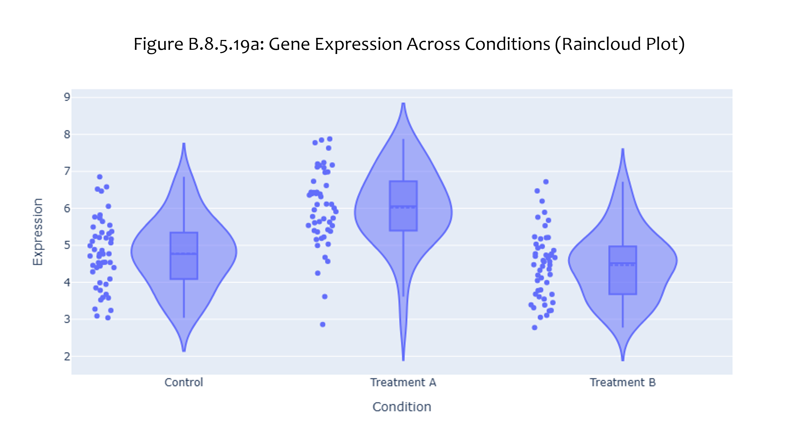
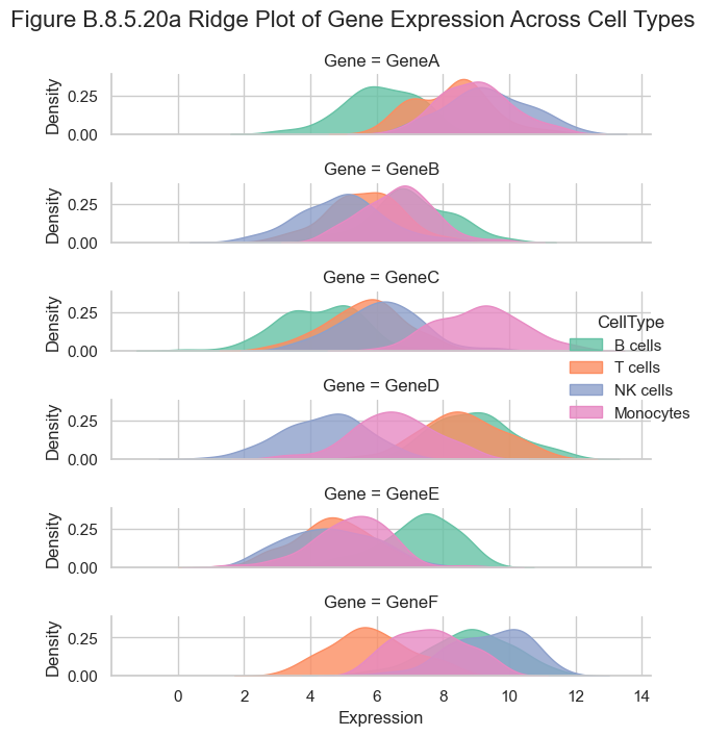
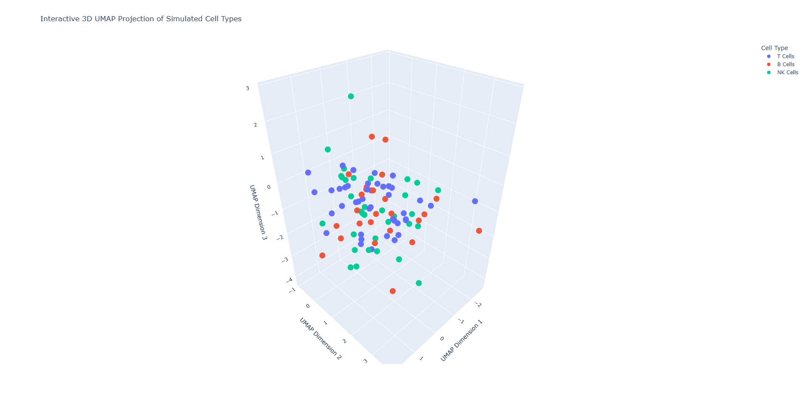

# Biomedical-Interactive-Visuals

[](https://github.com/niisaban/Biomedical-Interactive-Visuals/actions/workflows/mini-pipeline.yml)
[](https://github.com/niisaban/Biomedical-Interactive-Visuals/releases)

Interactive visualization and analysis recipes for biological data — built to bridge real-world biomedical questions with modern data science.  
**Author:** Abdulrahman S. Hammond • **Domain:** Immunology, clinical/biomarker data • **Focus:** Reproducible analysis + cloud-ready patterns.

---

## About this book

**Biological Research: A Biologist’s Complete Applied Guide to Visualization, Analysis, and the Future** is a practical, code-forward guide for life scientists who want to turn real lab data into clear results. It blends experimental context with modern data wrangling, visualization, and lightweight AI/ML—with reproducible examples and interactive figures you can run and adapt. Whether you’re a bench scientist moving into computation, an instructor looking for applied materials, or a student building confidence, this project is designed to meet you where you are.

> Start with the [**Preface →**](PREFACE.md), or jump into the live, interactive examples below.

### Quick links

- 🏠 **Project site (landing page)** → <https://niisaban.github.io/Biomedical-Interactive-Visuals/>
- 🧪 **Mini Pipeline demo (interactive)** → <https://niisaban.github.io/Biomedical-Interactive-Visuals/PipelineDemo/site/>
- 📖 **Preface** → [PREFACE.md](PREFACE.md)
- 🏷️ **Releases** → <https://github.com/niisaban/Biomedical-Interactive-Visuals/releases>

## What’s inside

- **Visual Methods:** Raincloud, Ridge (Joy), UMAP (and more coming)  
- **Reproducible Notebooks:** Clean, commented Jupyter notebooks  
- **Interactive Demos:** Shareable HTML (via GitHub Pages)  
- **(Planned)** Mini data pipeline demos (local → cloud-ready patterns)  
- **Book tie-ins:** Samples from *Biological Research: A Biologist’s Complete Applied Guide to Visualization, Analysis, and the Future*
 
---

## 🚀 Live Demos (GitHub Pages)
- Raincloud Plot — https://niisaban.github.io/Biomedical-Interactive-Visuals/Interactive_RaincloudPlot_GeneExpression.html
- Ridge Plot —  https://niisaban.github.io/Biomedical-Interactive-Visuals/Interactive_RidgePlot_GeneExpression.html  
- UMAP — https://niisaban.github.io/Biomedical-Interactive-Visuals/Interactive_UMAP_3D_CellTypes.html

> Home page for all demos: **https://niisaban.github.io/Biomedical-Interactive-Visuals/**
## 👀 Preview

[](https://niisaban.github.io/Biomedical-Interactive-Visuals/Interactive_RaincloudPlot_GeneExpression.html)
[](https://niisaban.github.io/Biomedical-Interactive-Visuals/Interactive_RidgePlot_GeneExpression.html)
[](https://niisaban.github.io/Biomedical-Interactive-Visuals/Interactive_UMAP_3D_CellTypes.html)

---

## 📁 Repo Structure
Biomedical-Interactive-Visuals/
├─ docs/ # published HTML demos (GitHub Pages)
├─ assets/ # images (screenshots, thumbnails, diagrams)
│ └─ screenshots/
├─ Raincloud/
│ ├─ notebook.ipynb
│ ├─ data/ (tiny sample or link)
│ └─ README.md
├─ Ridge/
│ ├─ notebook.ipynb
│ └─ README.md
├─ UMAP/
│ ├─ notebook.ipynb
│ └─ README.md
├─ Pipeline-Demo/ # (planned) local-to-cloud pipeline example
│ ├─ notebook.ipynb
│ └─ README.md
├─ Book-Samples/ # (optional) excerpts that accompany the book
│ └─ chapter_notebook.ipynb
├─ requirements.txt
├─ environment.yml # optional (conda)
└─ README.md

## ⚡ Quickstart

> **Windows tip:** If PowerShell blocks script execution, run this once (in an
> elevated PowerShell) to allow venv activation scripts:
> `Set-ExecutionPolicy -Scope CurrentUser RemoteSigned`
>
> **Activate venv on Windows**
> - PowerShell: `.\.venv\Scripts\Activate.ps1`
> - CMD:       `.\.venv\Scripts\activate.bat`

```bash
# Clone
git clone https://github.com/niisaban/Biomedical-Interactive-Visuals.git
cd Biomedical-Interactive-Visuals

# Environment (choose one)
conda env create -f environment.yml && conda activate bio-vis
# or
python -m venv .venv && . .venv/bin/activate   # (Windows: see tip above)

# Install dependencies
pip install -r requirements.txt

# Run notebooks
jupyter lab


### 🔏 License
- **Code:** [MIT](LICENSE)
- **Content (figures, narrative text in notebooks, exported HTML demos):** [CC BY 4.0](LICENSE-CC-BY-4.0)

See [NOTICE](NOTICE) for scope details.

### 🧾 Citation
If you use this repository, please cite:

Hammond, A.S. (2025). *Biomedical-Interactive-Visuals* (v0.1.0). https://github.com/niisaban/Biomedical-Interactive-Visuals

For machine-readable metadata, see [CITATION.cff](CITATION.cff).

### 🤝 Contributing
Bug reports and suggestions are welcome — please open an [Issue](https://github.com/niisaban/Biomedical-Interactive-Visuals/issues).

### ❓ Questions
If you have questions about reproducing an example or adapting it to your data, open an Issue and mention the page/notebook.


